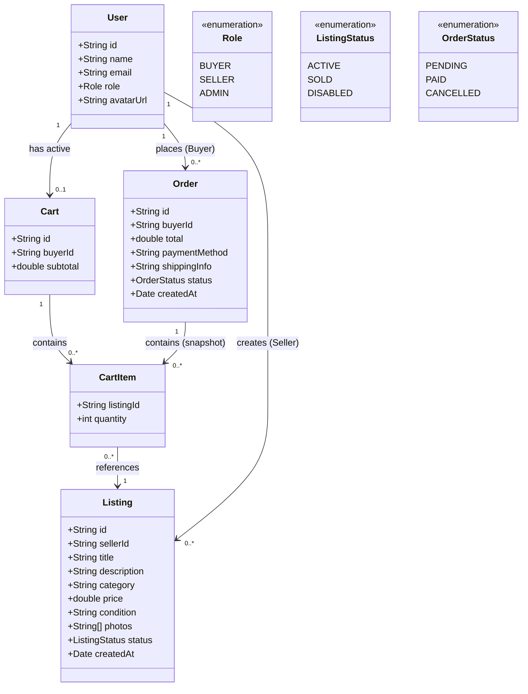
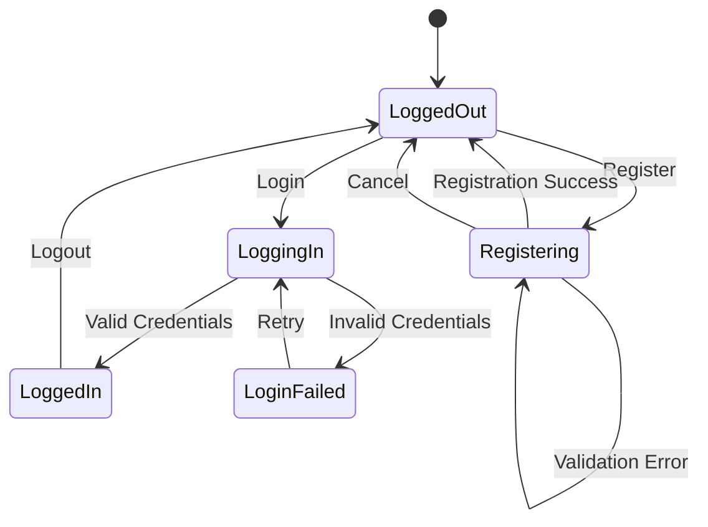
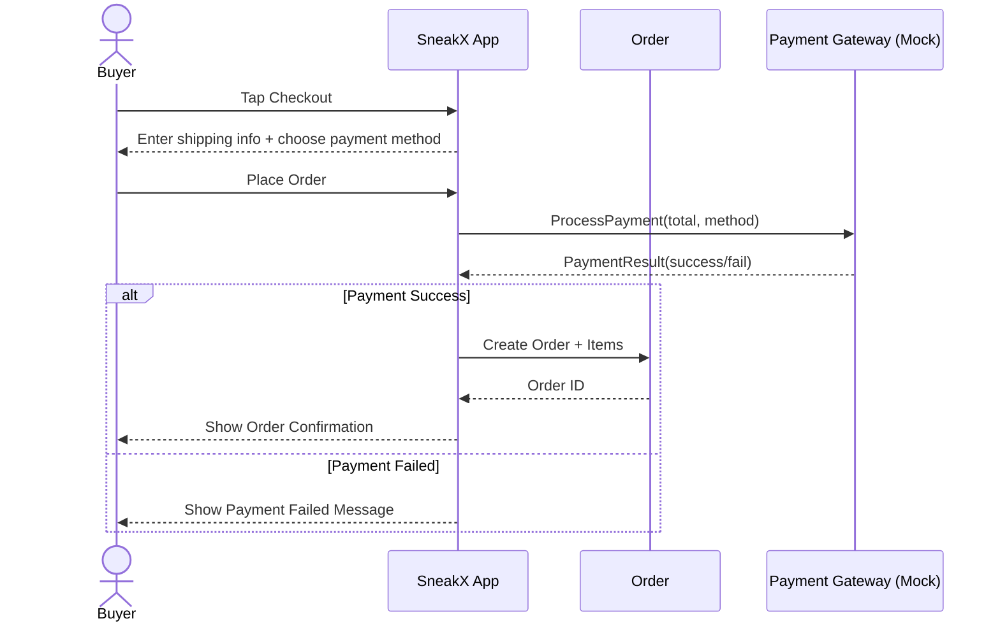
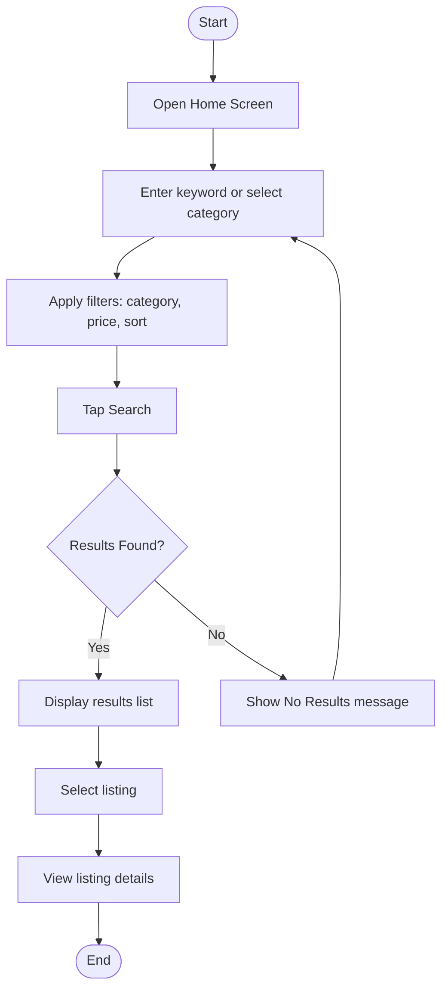

# SneakX – Shoe Marketplace App
**Team No.:** 3  
**Class:** CSE 3310; Spring 2026  
**Module:** System Requirements Analysis (SRA)  
**Deliverable:** SRA Document  
**Version:** 1.1 | **Date:** 04/10/2026

---

**Contributors:**
1. Saurav Patel (1002265166)
2. Jignesha Bendale (1002214866)
3. Shishir Sunar (1002232718)
4. Ishika Sanghadia (1002133686)

**Revision History:**

| Version | Date | Originator | Reason for Change | High Level Description |
|---------|------|------------|-------------------|------------------------|
| 1.0 | 03/02/2026 | Team 3 | Initial draft | Initial SRA document draft |
| 1.1 | 04/10/2026 | Team 3 | Increment update | Added UML diagrams |

---

## Table of Contents

1. [Introduction and Project Overview](#1-introduction-and-project-overview)
2. [Objectives](#2-objectives)
3. [Project Context Diagram](#3-project-context-diagram)
4. [UML Diagrams](#4-uml-diagrams)
5. [Systems Requirements](#5-systems-requirements)
6. [Software Processes and Infrastructure](#6-software-processes-and-infrastructure)
7. [Assumptions and Constraints](#7-assumptions-and-constraints)
8. [Delivery and Schedule](#8-delivery-and-schedule)
9. [Stakeholder Approval Form](#9-stakeholder-approval-form)
- [Appendix](#appendix)

---

## 1. Introduction and Project Overview

SneakX is a mobile-based shoe marketplace application designed for Android devices that enables users to securely buy and sell footwear within a structured digital marketplace. The system serves three primary user groups: **Buyers**, **Sellers**, and **Administrators**. SneakX addresses the problem of fragmented peer-to-peer shoe resale platforms by providing a centralized, role-based environment where listings, transactions, and account management are regulated under a unified system. The scope of the application includes user authentication, product listing management, shopping cart functionality, checkout processing, administrative moderation, and search capabilities.

The system provides differentiated capabilities based on user roles. Buyers can browse listings, search and filter products, add items to a cart, and complete purchases through a structured checkout process. Sellers can create, modify, and delete product listings and manage inventory visibility. Administrators are responsible for user account moderation, listing oversight, and enforcement of marketplace policies. Each role operates within defined permission boundaries enforced by role-based access control.

The system scope includes authentication services, marketplace listing management, payment processing simulation, cart management, profile management, and administrative controls. SneakX does not include external payment gateway integration or real-world financial processing. All operations occur within the application boundary as defined in the project context diagram.

### Major System Features

- **User Registration:** New users can create accounts by submitting required profile information and selecting their role (Buyer or Seller).
- **Secure Authentication:** Registered users can log in and log out securely using credential validation and session control.
- **Role-Based Access Control:** The system restricts access to features based on user roles (Buyer, Seller, Admin).
- **Product Listing Management:** Sellers can create, edit, and remove shoe listings with product details and images.
- **Search and Filtering:** Users can search products by keyword and filter listings by category and price range.
- **Shopping Cart Management:** Buyers can add, remove, and update quantities of items in their cart.
- **Checkout and Mock Payment Processing:** Buyers can confirm purchases through a simulated payment workflow.
- **Administrative Oversight:** Admin users can enable/disable user accounts and remove inappropriate listings.
- **Profile Management:** Users can update personal account information and application preferences.

---

## 2. Objectives

### 2.1 Business Objectives

- **BO-1:** Increase marketplace transaction efficiency by enabling buyers to complete purchases within 5 minutes under normal system load.
- **BO-2:** Ensure platform moderation by allowing administrators to review and take action on flagged listings within 24 hours.
- **BO-3:** Improve seller usability by allowing listing creation in under 3 minutes with structured input validation.
- **BO-4:** Maintain at least 95% successful login authentication rate under normal operating conditions.

### 2.2 System Objectives

- **SO-1:** The system shall authenticate user credentials within 2 seconds for 95% of login attempts.
- **SO-2:** The system shall support concurrent access for at least 100 active users without performance degradation.
- **SO-3:** The system shall restrict unauthorized feature access based on role-based permissions.
- **SO-4:** The system shall validate all required listing fields before submission.
- **SO-5:** The system shall maintain data persistence for user accounts, listings, and cart data during session activity.
- **SO-6:** The system shall provide search results within 3 seconds for keyword queries.
- **SO-7:** The system shall ensure that disabled users cannot log in or access system resources.

---

## 3. Project Context Diagram

```
┌─────────────────────────────────────────────────────────────────┐
│                  SneakX Mobile App (System Boundary)            │
│                                                                 │
│  ┌──────┐  1. Search, View, Buy ──►  ┌─────────────────────┐   │
│  │Buyer │                            │   SneakX Core System│   │
│  └──────┘                            │                     │   │──4. Process Payment──► ┌──────────────────────┐
│                                      │  Authentication     │   │                        │  Payment Gateway     │
│  ┌──────┐  2. List Shoes,      ──►   │  Inventory Mgmt     │   │◄─5. Confirm Transaction─│  (Mock Payment)      │
│  │Seller│     Manage Orders          │  Order Processing   │   │                        └──────────────────────┘
│  └──────┘                            │  Search Engine      │   │
│                                      └─────────────────────┘   │
│  ┌──────┐  3. Moderate Users   ──►                             │
│  │Admin │     & Listings                                        │
│  └──────┘                                                       │
└─────────────────────────────────────────────────────────────────┘
```

---

## 4. UML Diagrams

### 4.1 UML Diagram: "System"



### 4.2 UML Diagram: "Registration and Login"



### 4.3 UML Diagram: "Payments"



### 4.4 UML Diagram: "Search"



---

## 5. Systems Requirements

### 5.1 "Login" Requirements

| Field | Details |
|-------|---------|
| **Requirement Title** | User Authentication - Login |
| **Sequence No** | SR-LOGIN-001 |
| **Short Description** | The system shall authenticate registered users before granting access to protected features. |
| **Description** | The system shall validate username and password credentials against stored user records and establish a session upon successful authentication. |
| **Pre-Conditions** | • User account exists in the system database. • User account is not disabled by an administrator. |
| **Post Conditions** | • Successful login: User is redirected to role-based dashboard. • Failed login: Error message displayed. • After 5 consecutive failed attempts, account is temporarily locked. |
| **Priority** | High |
| **Risk** | Medium |
| **Testable** | Yes (response time ≤ 2 seconds) |

---

### 5.2 "Registration" Requirements

| Field | Details |
|-------|---------|
| **Requirement Title** | User Account Registration |
| **Sequence No** | SR-REG-001 |
| **Short Description** | The system shall allow new users to create an account with required personal information. |
| **Description** | The system shall collect required fields (name, email, password, role selection) and create a unique user account after validating input data. |
| **Pre-Conditions** | • User does not already have a registered account with the same email. |
| **Post Conditions** | • Account is created and stored. • User is redirected to login screen. • If validation fails, error message is displayed. |
| **Priority** | High |
| **Validation** | All required fields must be completed |
| **Testable** | Account creation completes within 3 seconds |

---

### 5.3 "Role Management" Requirements

| Field | Details |
|-------|---------|
| **Requirement Title** | Role-Based Access Control |
| **Sequence No** | SR-ROLE-001 |
| **Short Description** | The system shall restrict system features based on assigned user role. |
| **Description** | The system shall grant access permissions according to user role (Buyer, Seller, Admin) and prevent unauthorized feature access. |
| **Pre-Conditions** | • User is authenticated. |
| **Post Conditions** | • User dashboard displays role-specific features. • Unauthorized actions are blocked. |
| **Security** | Mandatory |
| **Testable** | Unauthorized role access attempts are denied 100% of the time |

---

### 5.4 "Product Listing" Requirements

#### SR-LIST-001: Create Product Listing

| Field | Details |
|-------|---------|
| **Requirement Title** | Create Product Listing |
| **Sequence No** | SR-LIST-001 |
| **Short Description** | The system shall allow sellers to create new shoe listings. |
| **Description** | The system shall enable sellers to input product name, description, category, price, and image, and publish the listing after validation. |
| **Pre-Conditions** | • Seller is authenticated. • Seller account is active. |
| **Post Conditions** | • Listing appears in marketplace. • Listing stored in system database. |
| **Validation** | All required fields must be completed |
| **Testable** | Listing published within 3 seconds |

#### SR-LIST-002: Edit Product Listing

| Field | Details |
|-------|---------|
| **Requirement Title** | Edit Product Listing |
| **Sequence No** | SR-LIST-002 |
| **Short Description** | The system shall allow sellers to modify existing listings. |
| **Description** | The system shall permit sellers to update listing information and save changes. |
| **Pre-Conditions** | • Seller owns the listing. • Seller is authenticated. |
| **Post Conditions** | • Updated information reflected immediately. • Old data replaced. |
| **Audit** | Changes must be timestamped |
| **Testable** | Update reflected within 2 seconds |

#### SR-LIST-003: Delete Product Listing

| Field | Details |
|-------|---------|
| **Requirement Title** | Delete Product Listing |
| **Sequence No** | SR-LIST-003 |
| **Short Description** | The system shall allow sellers to remove active listings. |
| **Description** | The system shall remove the selected listing from marketplace visibility. |
| **Pre-Conditions** | • Seller owns listing. • Seller authenticated. |
| **Post Conditions** | • Listing no longer visible to buyers. |
| **Testable** | Listing removal occurs immediately |

---

### 5.5 "Search" Requirements

#### SR-SEARCH-001: Keyword Search

| Field | Details |
|-------|---------|
| **Requirement Title** | Keyword Search |
| **Sequence No** | SR-SEARCH-001 |
| **Short Description** | The system shall allow users to search listings using keywords. |
| **Description** | The system shall retrieve listings matching entered keywords in title or description. |
| **Pre-Conditions** | • User is authenticated. |
| **Post Conditions** | • Search results displayed. • If no match found, system displays "No Results" message. |
| **Performance** | Results returned within 3 seconds |
| **Accuracy** | Results must match keyword criteria |

#### SR-SEARCH-002: Filter by Category and Price

| Field | Details |
|-------|---------|
| **Requirement Title** | Filter by Category and Price |
| **Sequence No** | SR-SEARCH-002 |
| **Short Description** | The system shall allow users to filter listings by category and price range. |
| **Description** | The system shall narrow search results based on selected category and user-defined price range. |
| **Pre-Conditions** | • Listings exist in system. |
| **Post Conditions** | • Filtered results displayed. |
| **Performance** | Results within 3 seconds |
| **Testable** | Filtering logic returns only matching entries |

---

### 5.6 "Cart" Requirements

#### SR-CART-001: Add Item to Cart

| Field | Details |
|-------|---------|
| **Requirement Title** | Add Item to Cart |
| **Sequence No** | SR-CART-001 |
| **Short Description** | The system shall allow buyers to add products to their shopping cart. |
| **Description** | The system shall store selected items in the buyer's cart until checkout or removal. |
| **Pre-Conditions** | • Buyer authenticated. • Product available. |
| **Post Conditions** | • Item appears in cart. • Cart total updated. |
| **Testable** | Cart updates instantly |

#### SR-CART-002: Update Cart Quantity

| Field | Details |
|-------|---------|
| **Requirement Title** | Update Cart Quantity |
| **Sequence No** | SR-CART-002 |
| **Short Description** | The system shall allow buyers to modify item quantities in the cart. |
| **Description** | The system shall recalculate total cost when quantity changes. |
| **Pre-Conditions** | • Item exists in cart. |
| **Post Conditions** | • Updated total displayed. |
| **Accuracy** | Total calculation must be correct to 2 decimal places |

#### SR-CART-003: Remove Item from Cart

| Field | Details |
|-------|---------|
| **Requirement Title** | Remove Item from Cart |
| **Sequence No** | SR-CART-003 |
| **Short Description** | The system shall allow buyers to remove items from cart. |
| **Description** | The system shall delete selected item and update cart total. |
| **Pre-Conditions** | • Item exists in cart. |
| **Post Conditions** | • Item removed. • Cart total recalculated. |
| **Testable** | Removal reflected immediately |

---

### 5.7 "Checkout" Requirements

| Field | Details |
|-------|---------|
| **Requirement Title** | Checkout Confirmation |
| **Sequence No** | SR-CHECK-001 |
| **Short Description** | The system shall allow buyers to confirm purchase through mock payment process. |
| **Description** | The system shall simulate payment validation and generate order confirmation. |
| **Pre-Conditions** | • Cart contains at least one item. • Buyer authenticated. |
| **Post Conditions** | • Order confirmation displayed. • Cart cleared. |
| **Performance** | Confirmation generated within 3 seconds |
| **Note** | Payment is simulated only |

---

### 5.8 "Admin" Requirements

#### SR-ADMIN-001: Disable User Account

| Field | Details |
|-------|---------|
| **Requirement Title** | Disable User Account |
| **Sequence No** | SR-ADMIN-001 |
| **Short Description** | The system shall allow administrators to disable user accounts. |
| **Description** | Admin can deactivate user accounts, preventing login and system access. |
| **Pre-Conditions** | • Admin authenticated. |
| **Post Conditions** | • User account status changed to inactive. • Disabled user cannot log in. |
| **Security** | Immediate enforcement required |

#### SR-ADMIN-002: Remove Inappropriate Listing

| Field | Details |
|-------|---------|
| **Requirement Title** | Remove Inappropriate Listing |
| **Sequence No** | SR-ADMIN-002 |
| **Short Description** | The system shall allow administrators to remove listings. |
| **Description** | Admin may delete listings violating marketplace policies. |
| **Pre-Conditions** | • Listing exists. |
| **Post Conditions** | • Listing removed from marketplace. |
| **Audit** | Admin action logged with timestamp |

---

### 5.9 "Profile" Requirements

| Field | Details |
|-------|---------|
| **Requirement Title** | Update User Profile |
| **Sequence No** | SR-PROFILE-001 |
| **Short Description** | The system shall allow users to update profile information. |
| **Description** | Users may edit personal information such as name, email, or preferences. |
| **Pre-Conditions** | • User authenticated. |
| **Post Conditions** | • Profile changes saved. |
| **Validation** | Email must remain unique |

---

## 6. Software Processes and Infrastructure

SneakX will follow an iterative development model with structured increments:

- Requirements definition
- UML modeling
- Incremental feature implementation
- Unit testing
- Integration testing
- Version control using Git

Requirement updates will be tracked using version numbers and documented in revision history.

### 6.1 Hardware and Infrastructure

| Component | Specification |
|-----------|--------------|
| **Android Version** | Android 12 or higher |
| **Development Environment** | Android Studio (latest stable version) |
| **Programming Language** | Java/Kotlin |
| **Version Control** | GitHub |
| **Testing** | Android Emulator and physical Android device |
| **Database** | Local persistent storage (Room/SQLite simulation) |

---

## 7. Assumptions and Constraints

### 7.1 Assumptions

- Users have stable internet connectivity.
- Android devices meet minimum OS requirements.
- Payment system is simulated and not connected to real financial institutions.
- Users provide accurate listing information.

### 7.2 Constraints

- Platform limited to Android devices only.
- No real-world payment processing integration.
- Development timeframe limited to semester duration.
- No third-party API integration allowed.

### 7.3 Out of Scope Material

- Real payment gateway integration.
- Shipping logistics integration.
- Advanced AI-based product recommendations.
- Multi-language support.
- Web-based version of the application.

---

## 8. Delivery and Schedule

| Task/Milestone | Anticipated Start | Anticipated End | Status | Comments |
|----------------|-------------------|-----------------|--------|----------|
| Prepare Requirements and UML diagram | 02/08/2026 | 02/13/2026 | ✅ Completed | Initial system modeling |
| SRA Document (objectives, requirements, UML) | 02/26/2026 | 03/02/2026 | ✅ Completed | System requirements finalized |
| Login and registration module | 03/10/2026 | 03/18/2026 | ⏳ Pending | Authentication functionality |
| Product listing and search module | 03/18/2026 | 04/02/2026 | ⏳ Pending | Seller listing and buyer search |
| Admin management features | 04/02/2026 | 04/15/2026 | ⏳ Pending | Account and listing moderation |
| System design implementation | 03/05/2026 | 03/25/2026 | ⏳ Pending | Begin development of core features |
| Test case design | 03/25/2026 | 04/05/2026 | ⏳ Pending | Creating and validating test cases |
| External Documentation (User Manual) | 04/05/2026 | 04/12/2026 | ⏳ Pending | Documentation for users |
| Project presentation | 04/15/2026 | 04/22/2026 | ⏳ Pending | In-class presentation |
| Final Milestone: project delivery | 04/24/2026 | 04/24/2026 | ⏳ Pending | Final system submission |

---

## 9. Stakeholder Approval Form

| Stakeholder Name | Stakeholder Role | Stakeholder Comments | Approval |
|------------------|-----------------|----------------------|----------|
| Saurav Patel | Project Lead | Requirements match system scope. | |
| Jignesha Bendale | Developer | Architecture supports local storage. | |
| Shishir Sunar | Developer | Role-based permissions validated. | |
| Ishika Sanghadia | QA / Testing | All requirements are testable. | |

---

## Appendix

### Appendix A – Glossary of Terms

| Term | Definition |
|------|-----------|
| **Buyer** | A registered user who purchases products from the marketplace. |
| **Seller** | A registered user who creates and manages product listings. |
| **Administrator** | A privileged user responsible for moderating accounts and listings. |
| **RBAC** | Role-Based Access Control — a security model where system permissions are assigned based on user roles. |
| **Mock Payment** | A simulated payment process used for testing without real financial transactions. |
| **Listing** | A product entry created by a seller containing name, description, category, price, and image. |
| **Session** | A temporary authenticated interaction between the user and the system. |
| **Authentication** | The process of validating user credentials before granting access. |
| **Authorization** | The process of granting system access based on user role. |

---

### Appendix B – Requirement Traceability Matrix

| Requirement ID | Business Objective (BO) | System Objective (SO) | Test Case ID |
|----------------|------------------------|----------------------|--------------|
| SR-LOGIN-001 | BO-4 | SO-1 | TC-LOGIN-01 |
| SR-REG-001 | BO-3 | SO-4 | TC-REG-01 |
| SR-ROLE-001 | — | SO-3 | TC-ROLE-01 |
| SR-LIST-001 | BO-3 | SO-4 | TC-LIST-01 |
| SR-LIST-002 | BO-3 | SO-4 | TC-LIST-02 |
| SR-LIST-003 | BO-3 | SO-4 | TC-LIST-03 |
| SR-SEARCH-001 | BO-1 | SO-6 | TC-SEARCH-01 |
| SR-SEARCH-002 | BO-1 | SO-6 | TC-SEARCH-02 |
| SR-CART-001 | BO-1 | SO-5 | TC-CART-01 |
| SR-CART-002 | BO-1 | SO-5 | TC-CART-02 |
| SR-CART-003 | BO-1 | SO-5 | TC-CART-03 |
| SR-CHECK-001 | BO-1 | SO-2 | TC-CHECK-01 |
| SR-ADMIN-001 | BO-2 | SO-7 | TC-ADMIN-01 |
| SR-ADMIN-002 | BO-2 | SO-7 | TC-ADMIN-02 |
| SR-PROFILE-001 | — | SO-5 | TC-PROFILE-01 |
